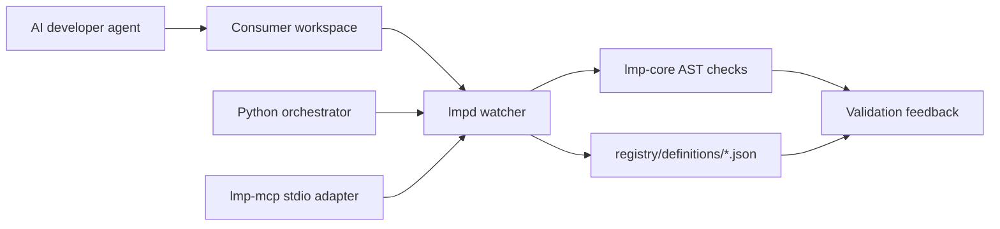

# Lending-Mind Protocol Architecture

## System summary

Lending-Mind Protocol is a Rust workspace for validating source changes against
machine-readable engineering profiles. Python scripts provide benchmark and
documentation orchestration; the Node package bootstraps a consuming project.

The configured Git remote is `origin`:
`https://github.com/lendmind-protocol/LMP.git`.

## Repository layout

```text
.
├── crates/
│   ├── lmp-core/        # Reusable AST, signature, and skill-validation code
│   ├── lmpd/            # Local workspace watcher and validation daemon
│   ├── lmp-mcp/         # JSON-RPC stdio adapter for MCP-style tool calls
│   └── lmp-sync/        # Local profile synchronization CLI
├── orchestrator/        # Python test-bed, metrics, and docs tooling
├── packages/create-lmp/ # Node.js consumer-project bootstrapper
├── registry/
│   ├── definitions/     # Engineering profile JSON documents
│   └── schemas/         # Registry JSON schemas
├── docs/                # Concept, onboarding, and solution notes
├── .github/             # Issue templates and CI/release workflows
└── ARCHITECTURE.md      # This navigation document
```

## High-level flow



## Crate responsibilities

| Crate | Entry point | Responsibility |
| --- | --- | --- |
| `lmp-core` | `src/lib.rs` | AST traversal, Ed25519 package verification, and skill manifest auditing. `src/bin/mind_signer.rs` signs profile payloads. |
| `lmpd` | `src/main.rs` | Loads a profile, watches a workspace, parses changed Rust files through `lmp-core`, and reports structural violations. |
| `lmp-mcp` | `src/main.rs` | Reads JSON-RPC requests from stdin and audits workspaces through `lmp-core`. |
| `lmp-sync` | `src/main.rs` | Validates and copies a local registry profile into a consumer workspace. |

## Data flow

1. `lmpd` receives `--mind` and `--workspace` paths.
2. It deserializes the profile's telemetry limits.
3. File changes are received from `notify`.
4. Rust files are parsed with `syn`.
5. Function density and forbidden AST nodes are checked.
6. Violations are printed as invalidation feedback.

Profile signing is separate: `mind-signer` signs the exact profile bytes and
writes key and detached-signature files to the requested output directory.

## Where to edit

- AST rules: `crates/lmp-core/src/ast.rs` and `crates/lmpd/src/main.rs`
- Package verification: `crates/lmp-core/src/crypto.rs`
- Profile validation: `crates/lmp-core/src/skills.rs`
- Profile documents: `registry/definitions/`
- Registry schemas: `registry/schemas/`
- Benchmark behavior: `orchestrator/`
- Consumer bootstrap: `packages/create-lmp/bin.js`
- CI and releases: `.github/workflows/`

## Development commands

```bash
cargo check --workspace
cargo test --workspace
python3 orchestrator/test_bed.py
python3 orchestrator/plot_metrics.py
```

Build a specific binary with `cargo build --bin lmpd` or
`cargo build --bin mind-signer`.

## Current boundaries

- Registry synchronization is local-file based. OCI/IPFS transport remains a
  future integration boundary rather than a fabricated network implementation.
- The MCP adapter and `lmpd` share the same `lmp-core::ast::audit_source`
  validator, so their findings are consistent.
- The repository contains design notes in `docs/` that describe future system
  capabilities; this document reflects the code that exists in the checkout.
