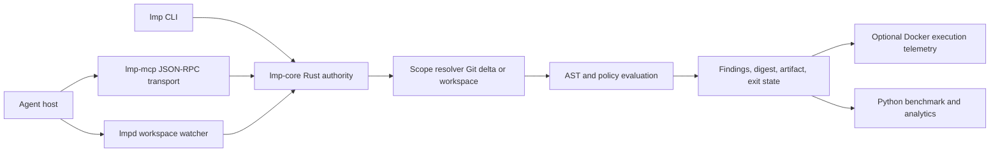
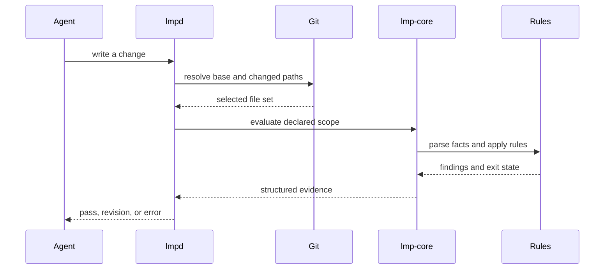
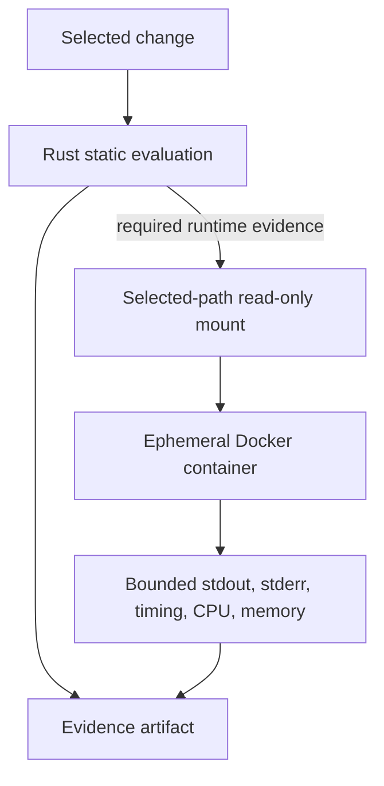

# Systems architecture

LMP is a policy-evaluation system for agent-generated changes. Its architecture
has one authority: the Rust runtime. Profiles, scope selection, parsing, rule
evaluation, digests, findings, and final exit states are resolved by
`lmp-core`. The [Rust Book](https://doc.rust-lang.org/book/) provides the
language foundation for contributors. The daemon, CLI, and MCP server are delivery surfaces over that
same runtime; they are not independent policy engines.

Python and Node.js have deliberately narrower responsibilities. [Python](https://docs.python.org/3/)
orchestrates [Docker](https://docs.docker.com/engine/containers/resource_constraints/)
execution, benchmark coordination, and analytics. [Node.js](https://nodejs.org/learn)
provides the friendly onboarding and package-delivery wrapper. Neither layer
redefines what a rule means or changes a Rust result into a pass.

## Runtime topology



## Component responsibilities

| Component | Owns | Must not own |
| --- | --- | --- |
| `lmp-core` | Package compilation, integrity, scope, parsing, rules, findings, artifacts | Agent-host UX or benchmark presentation |
| `lmpd` | Watching a workspace and invoking the core evaluator | A second interpretation of policy |
| `lmp-mcp` | JSON-RPC discovery, guidance, evaluation, and evidence transport | Turning a failed result into success |
| `lmp` | Direct local CLI access to the same core operations | Silent changes to scope or profile identity |
| Python orchestrator | Docker lifecycle, benchmark matrix, metrics, reports | Reimplementing Rust policy semantics |
| Node.js wrapper | Onboarding and distribution convenience | Replacing the native evaluator |

## Profile activation and deterministic evaluation

An evaluation begins by resolving the selected Mind package, validating its
schema and integrity metadata, and computing the package digest. The evaluator
then resolves the workspace scope, parses supported source files, applies the
declared rules, and emits structured findings. The result retains the profile
identity, digest, evaluator version, mode, selected files, and final state so a
later reader can reproduce the decision.

```text
select package
  → validate schema and signature
  → resolve workspace or Git scope
  → parse supported files
  → apply profile rules
  → emit findings and artifact
  → optionally run bounded execution telemetry
```

The active Mind is configuration, not a hidden model persona. Its guidance can
shape an agent's input, but only the evaluator can produce the policy result.
This separation makes it possible to compare an unguided baseline with a
guided and evaluated change without confusing instructions with proof.

## Changed-file evaluation and brownfield scope

Large repositories normally use changed-only evaluation. The scope resolver
compares the workspace with an explicit Git base and selects modified and
untracked files. Rules may request repository context, for example a manifest,
when a source file adds a dependency, but that expansion must be visible in the
artifact. Changed-only mode is a bounded feedback loop, not a claim that
unchanged code is safe.



An empty delta is a valid result. A non-Git workspace is a disclosed fallback,
not a silently broadened comparison. Every result should make clear:

- the base revision or fallback mode;
- selected and excluded files;
- the reason a contextual file was included;
- parser and cache information;
- the active rules and package digest.

## Isolation boundary

Static policy evaluation happens in Rust. Runtime evidence is an explicit,
separate Docker step used only when a scenario needs it. The Python sandbox
mounts selected paths read-only by default, disables networking, drops Linux
capabilities, applies PID, CPU, and memory limits, and truncates captured
output. The qualification image uses a 128 MiB memory ceiling and records
whether the sandbox gate actually ran.



Sandbox telemetry does not replace a Rust finding. If Docker or the required
image is unavailable, an end-to-end benchmark is `blocked`; it is never
reported as complete by treating a missing gate as a zero.

## Evidence and failure boundaries

The result state is part of the protocol contract:

- `pass` means the selected files passed the selected rules;
- `needs_revision` means a required rule found a violation;
- `blocked` means an integrity or execution boundary prevented an accepted
  decision.
- `evaluation_error` means the evaluator could not produce a trustworthy
  result; it is not converted into a pass.

An advisory finding is not a block. Guidance is not an evaluation. A successful
evaluation is not a claim that the entire repository is defect-free. These
boundaries keep the architecture honest while still making policy decisions
strict, inspectable, and reproducible.

Malformed requests, missing packages, and transport failures are errors at the
CLI or MCP boundary. An `evaluation_error` is reserved for failures after the
evaluation path starts and should be repaired before interpreting policy
findings.

## Scaling mechanics

Profiles are compiled before the active generation loop and represented by
compact, content-addressed layers. The hot path loads the verified policy
bundle, evaluates the relevant change, and leaves historical source material
in registry or cache storage. AST and profile caches can reduce repeated work,
but cache hits never bypass digest or scope recording.

The benchmark and analytics layer measures cold and warm package loading,
selected-file counts, cache behavior, evaluation latency, memory, findings,
and state transitions. Those measurements belong in [Benchmark
analytics](/docs/reference/results), not in the architecture's
policy authority.
