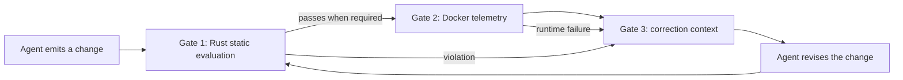

# Guidance, enforcement, and code quality

This is a focused reference. For the complete explanation in one continuous
reading path, start with [What is LMP?](/docs/concepts/overview), which owns the
canonical problem statement, policy loop, enforcement boundaries, and evidence
interpretation.

LMP has two control surfaces:

- **Guidance** changes the agent's available instructions before generation.
- **Enforcement** evaluates the produced change after generation and can reject it.

This separation makes the effect measurable. Run the same task with and without
a profile, record the generated diff, and compare findings, test outcomes, and
artifact metadata. If the output changed, the evidence must say whether the
change came from guidance, enforcement, or both.

## What “quality” means here

“High quality” is not a visual impression or a model confidence score. It is the
result of applying an explicit Mind to a declared scope and recording the
evidence produced by that run. The active Mind decides which dimensions and
thresholds apply; none is a universal style rule for every domain.

### Scorecard dimensions

1. **Logic density.** Count decision points against the profile's complexity
   budget. A lower budget favors shallow, testable control flow.
2. **Dependency allocation.** Inspect manifest changes and dependency policy.
   A profile may reject a heavy package for a small operation or require a
   reason for a new dependency.
3. **Structural correctness.** Check supported syntax and source patterns
   through the Rust evaluator. Each language parser and limitation must be
   named; `syn` is not a universal parser for every language.
4. **Runtime footprint.** When required, run the candidate in Docker and record
   bounded timing, output, CPU, memory, and selected-path behavior. A browser
   preview or static result is not runtime telemetry.

Profiles may set thresholds such as a complexity ceiling or target startup
latency, but the artifact must say whether a threshold was measured, simulated
for a preview, or not evaluated.

## Enforcement levels

1. **Advisory:** report a concern without failing the command.
2. **Required:** fail when the rule is violated in the selected scope.
3. **Proven:** require a passing test or attestation in addition to the rule.

An advisory finding must never be described as a block. The CLI exit state and
serialized result are the source of truth.

## The three-gate loop

**Gate 1: structural check.** Resolve the Mind, verify integrity, select Git
or workspace scope, parse supported files, and emit rule IDs, locations,
severity, evidence, and remediation.

The Rust evaluator records this parser boundary in each artifact. Rust uses
[`syn-2`](https://docs.rs/syn/latest/syn/) for Rust 2021 syntax. The TypeScript
evaluator uses the [TypeScript compiler API](https://github.com/microsoft/TypeScript/wiki/Using-the-Compiler-API)
for TypeScript and JavaScript AST traversal.
The standalone Rust path uses its deterministic `line-policy-v1` adapter for
configured TypeScript/JavaScript lexical rules; it does not silently claim
TypeScript compiler coverage when the Node evaluator is not running. Common Go, Python,
JVM, C-family, SQL, and HCL/Terraform files are reported in `skippedChecks` as
unsupported rather than silently counted as checked. A result with an
unsupported language is bounded evidence, not proof that the whole repository
was analyzed.

**Gate 2: execution check.** The Python `DockerSandbox` is an explicit step
for scenarios that need runtime evidence. It uses read-only mounts, disabled
networking, dropped capabilities, bounded output, CPU and PID limits, and a 128
MiB memory ceiling, following Docker's documented [resource-constraint model](https://docs.docker.com/engine/containers/resource_constraints/).
If Docker or the required image is unavailable, the
end-to-end benchmark is blocked, not complete.

**Gate 3: correction context.** A failed run returns the failing rule, source
location, observed value, expected constraint, and remediation. The host may
ask for a revision, but it cannot rewrite a failed result into a pass. A
revision is a new run with a new evidence record.

## Controlled comparison

Keep the task, workspace revision, model or host, active profile, and evaluation
scope fixed. Change one input at a time. Otherwise a different repository state
or broader file scope can look like a policy effect.

| Property | Unguided baseline | LMP-guided and evaluated change |
| --- | --- | --- |
| Compute locality | May pull data into application loops | Can require filtering and authorization at the data boundary |
| Dependencies | May add familiar packages for small operations | Applies the active profile's dependency policy |
| Error flow | May hide decisions in broad recovery paths | Makes declared error and boundary rules reviewable |
| Runtime claims | No reproducible footprint evidence | Records Docker telemetry when the scenario actually runs it |

## How to read a result

- “The profile was loaded and its signature verified” is an integrity result.
- “The agent received compiled guidance” is a host integration result.
- “The evaluator found a required violation” is an enforcement result.
- “The selected files passed the selected rules” is a scoped policy result.

Do not expand any of those into “the agent generated production-quality code.”
A passing result proves the selected files passed the selected rules under the
recorded profile, evaluator version, scope, and execution conditions. Teams
still need tests, review, threat modeling, dependency auditing, and domain
judgment for properties the package does not encode.

## Minimal proof fixture

Create one fixture that should pass and one that should fail. Run both with the
same package and scope. The failing fixture should identify rule, location,
severity, and next action. The passing fixture should show that a compliant
implementation is accepted. This pair is more useful than a large rule list
with no negative case.

For the reproducible benchmark against public repositories, see [Proof matrix
and real-world demos](/docs/reference/results). For the serialized
evidence contract, see [Reading results](/docs/reference/results).
