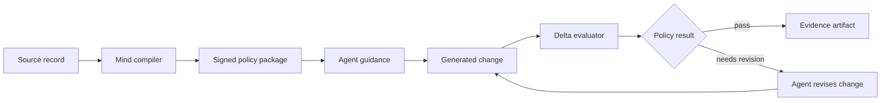
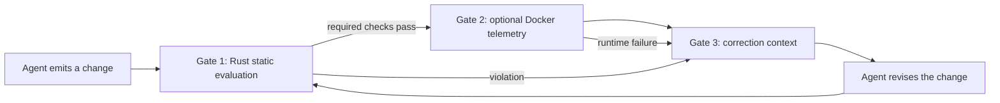

## The problem

An agent can produce syntactically valid code while violating the engineering preferences that matter to a team: unsafe boundaries, weak tests, accidental dependencies, or a style that makes future change expensive. This is a community signal, not a claim that every generated change fails: the [2024 Stack Overflow AI survey](https://survey.stackoverflow.co/2024/ai) describes a gap between AI use and trust, while [OWASP's secure-coding guidance](https://cheatsheetseries.owasp.org/cheatsheets/Secure_Coding_with_AI_Cheat_Sheet.html) treats AI-assisted output as code that still requires security review. A prompt can describe those preferences, but a prompt alone is not a durable proof.

There are two different questions hiding inside an agent workflow:

1. What should the agent pay attention to while it plans and writes?
2. Did the resulting change satisfy the rules that the team agreed to enforce?

The first question needs useful guidance. The second needs a deterministic check. Treating them as the same thing creates confusing reports. An agent may receive excellent guidance and still produce a change that fails a required rule. It may also produce acceptable code even when a guidance step was not followed exactly. LMP keeps both facts visible.

LMP creates a repeatable path from source material to a policy decision:

```text
source record → compiled Mind package → agent guidance → changed-file evaluation → signed evidence
```



## What LMP treats as a decision

The protocol distinguishes three layers:

1. **Preference:** a documented philosophy, method, trade-off, or example.
2. **Guidance:** an agent-readable instruction derived from that preference.
3. **Enforcement:** a deterministic rule that can accept, reject, or qualify a change.

The distinction matters. A blog post may justify a preference; it does not automatically become a hard gate. A hard gate must have a declared rule, scope, severity, and testable outcome.

For example, a source may argue that error handling should be explicit at a service boundary. That source becomes a preference record. The agent guidance might say to return a typed error and preserve the original cause. The enforceable part could be a rule that checks for an untyped fallback in a particular module. The source, guidance, and rule are related, but they are not interchangeable.

## What happens during a run

At the start of a run, the host chooses a profile and a workspace scope. LMP verifies the profile before exposing its guidance. The evaluator then resolves the files in scope, parses the supported source files, applies the selected rules, and writes a structured result. The result should tell you what LMP actually checked, not what the agent intended to do.

For a brownfield repository, the scope is usually the [Git](https://git-scm.com/book/en/v2) delta. That keeps the run focused while still allowing a rule to request repository context when it has a reason to do so. A broader scope must appear in the evidence.

## Why LMP when an agent already has rules or MCP

Agent hosts already provide instruction files, prompts, hooks, and MCP
connections. LMP does not replace those surfaces. It adds the policy and
evidence boundary they do not own: a versioned Mind, deterministic evaluation,
and a recorded acceptance decision.

An instruction file can be overlooked during a long generation loop. MCP can
transport a tool call without deciding whether the resulting change satisfies
a complexity budget, dependency policy, or security boundary. LMP connects
those surfaces to one acceptance path:

```text
agent change → Rust Mind and scope evaluation → optional Docker evidence
             → pass, needs_revision, blocked, or evaluation_error
```

This makes the configured decision inspectable without claiming that an agent
is infallible or that a passing policy result replaces tests, review, threat
modeling, or domain judgment. For the host setup, see [MCP integration](/docs/guides/mcp-integration).

Malformed requests, unavailable tools, and transport failures are reported as
request or execution errors by the CLI or MCP boundary. An `evaluation_error`
means LMP could not produce a trustworthy artifact after entering evaluation;
it is never a pass and must be repaired or investigated before interpreting
policy findings.

## A claim must have a trail

Public source records identify the publisher, URL, source kind, and digest.
LMP stores provenance metadata and the interpretation used to derive a rule;
it does not present a source as an endorsement. A useful evidence trail can
answer three separate questions:

1. What public observation informed the preference?
2. What guidance did the active Mind give the agent?
3. Which deterministic rule produced the final finding?

That separation is the difference between “the model seemed to like this
style” and an engineering decision another person can inspect and rerun. The
interactive preview is available in [Inspect a policy fixture](/docs/guides/playground),
but its values are illustrative; the CLI or MCP artifact is the production
evidence.

## Community signals behind the design

LMP's direction responds to recurring observations from developers,
maintainers, security practitioners, and software-engineering researchers. The
sources below are evidence for the problem framing and design priorities; they
are not endorsements of LMP, and none of them proves that LMP itself works.

| Author or community source | Reported observation | What it informs in LMP |
| --- | --- | --- |
| [Stack Overflow Developer Survey team](https://survey.stackoverflow.co/2025/ai) | The 2025 survey reports that more developers distrust AI output than trust it, with experienced developers among the most cautious groups. | LMP records a scoped result and its evidence instead of treating generated output as self-validating. |
| [GitHub Docs contributors](https://docs.github.com/en/copilot/tutorials/review-ai-generated-code) | GitHub's review guidance recommends functional checks, context and intent checks, quality review, dependency scrutiny, and collaborative review for AI-generated code. | LMP separates agent guidance from deterministic evaluation and keeps human review in the release boundary. |
| [OWASP Cheat Sheet Series team](https://cheatsheetseries.owasp.org/cheatsheets/Secure_Coding_with_AI_Cheat_Sheet.html) | The guidance identifies hallucinated dependencies, prompt injection, MCP/tool security, sandboxing, out-of-scope edits, and test fabrication as distinct risks. | LMP uses package provenance, dependency rules, explicit scope, MCP boundaries, sandbox telemetry, and evidence artifacts as separate controls. |
| [Martin Fowler](https://martinfowler.com/articles/structured-prompt-driven/iterative-review.html) | His iterative-review guidance frames AI assistance as an engineering loop: keep the specification ahead of implementation, check architecture, and verify before accepting the result. | LMP models generation as guidance → change → evaluation → revision, rather than a one-shot prompt. |
| [Birgitta Böckeler](https://www.martinfowler.com/articles/exploring-gen-ai/13-role-of-developer-skills.html) | Her field report emphasizes careful review of agent-generated changes and the continuing importance of developer skill and judgment. | LMP makes the rule outcome inspectable without claiming that automation replaces domain ownership. |
| [Google Research authors of AutoCommenter](https://research.google/pubs/ai-assisted-assessment-of-coding-practices-in-industrial-code-review/) | Their industrial study reports that automated learning of language practices can be useful at scale, while also describing deployment and adoption challenges. | LMP treats automated checks as bounded, versioned policy, not as a universal substitute for review or architecture judgment. |
| [Klemmer, Horstmann, Patnaik, and colleagues](https://arxiv.org/abs/2405.06371) | Their qualitative study found that professionals use AI in security-critical work while still expressing security and quality concerns, leading them to recommend critical checking. | LMP makes security-sensitive rules, provenance, and final acceptance evidence explicit before a change is treated as compliant. |

The common thread is not that every team needs the same rules. It is that
high-throughput generation increases the value of explicit context, reviewable
boundaries, and evidence that another engineer can inspect. LMP turns that
shared engineering concern into a protocol with declared scope and measurable
claims; the claims still require the project's own tests, benchmarks, and
human review.

## What LMP does not claim

LMP does not claim that one profile is universally correct, that a signature proves the quality of a rule, or that an agent will always follow guidance. Signatures prove artifact integrity and signer identity. Evaluation proves the declared rules were applied to the selected change. Those are strong, separate claims.

## The implementation boundary

Rust owns protocol semantics and enforcement; the [Rust Book](https://doc.rust-lang.org/book/) is the language reference for contributors. Python provides optional sandboxing and analysis orchestration, using the [Python documentation](https://docs.python.org/3/) as its language reference. TypeScript/Node.js provides the onboarding and package-facing delivery surface where the ecosystem requires it; see [Node's learning resources](https://nodejs.org/learn) for the supported runtime surface.

Those language boundaries do not create three competing protocols. The Rust implementation is the canonical enforcement path. Python and TypeScript call into the workflow where their ecosystems are useful, and their results must remain compatible with the same package and evidence contracts.

## Guidance, enforcement, and code quality

The protocol has two control surfaces:

- **Guidance** gives an agent useful, bounded instructions before generation.
- **Enforcement** evaluates the produced change after generation and can reject it when a required rule is violated.

These are deliberately separate. A prompt can influence a plan, but it cannot prove that the resulting change followed the plan. LMP evaluates the selected scope and records whether the configured checks produced `pass`, `needs_revision`, `blocked`, or `evaluation_error`.

Quality is therefore not a model confidence score or a universal style judgment. It is the result of applying an explicit Mind to a declared scope. Depending on the profile and scenario, the evidence can cover logic density, dependency changes, supported syntax, runtime footprint, security boundaries, and delivery safety.

### The three-gate loop



Gate 1 resolves the Mind, verifies integrity, selects Git or workspace scope, parses supported files, and emits rule IDs, locations, severity, evidence, and remediation. Rust uses `syn` for Rust syntax; the TypeScript evaluator uses the TypeScript compiler API. Unsupported languages are reported as skipped checks rather than silently counted as analyzed.

Gate 2 is an explicit runtime-evidence step, not a universal write firewall. The Python Docker sandbox can use read-only mounts, disabled networking, dropped capabilities, bounded output, CPU/PID limits, and a 128 MiB memory ceiling when the scenario requires it. If Docker or the required image is unavailable, that scenario is blocked rather than presented as complete.

Gate 3 returns correction context: the failing rule, source location, observed value, expected constraint, and remediation. A revision is a new run with a new evidence record. A failed result cannot be rewritten into a pass by narrative.

### What “enforced” means

An **advisory** rule reports a concern without failing the command. A **required** rule fails when the declared condition is violated in scope. A **proven** result additionally requires a passing test or attestation. The artifact and CLI exit state are the source of truth; prose must not turn advisory findings into blocks or scoped results into universal guarantees.

## Mind packages: from source to executable policy

A Mind package is a versioned policy artifact, not a model checkpoint and not a raw archive of everything a person has written. It contains the parts needed to make an engineering point of view inspectable:

- **Identity** names the profile, version, and publisher.
- **Guidance** gives the agent explicit, bounded instructions.
- **Rules** define deterministic checks and severities.
- **Provenance** records the source and the interpretation.
- **Integrity** lets the consumer detect tampering before activation.

Keep these statements separate when reviewing a package:

1. A public source makes an observable recommendation.
2. The package author interprets that recommendation as a preference.
3. A rule makes a bounded part of that interpretation testable.

The source does not become an endorsement of LMP merely because it appears in a package. The compiler normalizes source records, validates the schema, computes a content digest, and emits a deterministic bundle. Compilation should fail on an incomplete or ambiguous package rather than silently inventing semantics. The signed package, fixtures, and review metadata show whether a profile is ready to activate; a signature alone does not prove that its policy is wise.

For the complete field contract and review sequence, use [Mind Vault](/docs/reference/mind-vault). The former standalone pages for [enforcement](/docs/concepts/enforcement) and [Mind packages](/docs/concepts/mind-packages) remain available as focused references, but this page is the canonical human reading path.
