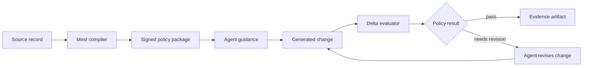

## The problem

An agent can produce syntactically valid code while violating the engineering preferences that matter to a team: unsafe boundaries, weak tests, accidental dependencies, or a style that makes future change expensive. A prompt can describe those preferences, but a prompt alone is not a durable proof.

There are two different questions hiding inside an agent workflow:

1. What should the agent pay attention to while it plans and writes?
2. Did the resulting change satisfy the rules that the team agreed to enforce?

The first question needs useful guidance. The second needs a deterministic check. Treating them as the same thing creates confusing reports. An agent may receive excellent guidance and still produce a change that fails a required rule. It may also produce acceptable code even when a guidance step was not followed exactly. LMP keeps both facts visible.

LMP creates a repeatable path from source material to a policy decision:

```text
source record → compiled Mind package → agent guidance → changed-file evaluation → signed evidence
```



## What LMP treats as a decision

The protocol distinguishes three layers:

1. **Preference:** a documented philosophy, method, trade-off, or example.
2. **Guidance:** an agent-readable instruction derived from that preference.
3. **Enforcement:** a deterministic rule that can accept, reject, or qualify a change.

The distinction matters. A blog post may justify a preference; it does not automatically become a hard gate. A hard gate must have a declared rule, scope, severity, and testable outcome.

For example, a source may argue that error handling should be explicit at a service boundary. That source becomes a preference record. The agent guidance might say to return a typed error and preserve the original cause. The enforceable part could be a rule that checks for an untyped fallback in a particular module. The source, guidance, and rule are related, but they are not interchangeable.

## What happens during a run

At the start of a run, the host chooses a profile and a workspace scope. LMP verifies the profile before exposing its guidance. The evaluator then resolves the files in scope, parses the supported source files, applies the selected rules, and writes a structured result. The result should tell you what LMP actually checked, not what the agent intended to do.

For a brownfield repository, the scope is usually the Git delta. That keeps the run focused while still allowing a rule to request repository context when it has a reason to do so. A broader scope must appear in the evidence.

## What LMP does not claim

LMP does not claim that one profile is universally correct, that a signature proves the quality of a rule, or that an agent will always follow guidance. Signatures prove artifact integrity and signer identity. Evaluation proves the declared rules were applied to the selected change. Those are strong, separate claims.

## The implementation boundary

Rust owns protocol semantics and enforcement. Python provides optional sandboxing and analysis orchestration. TypeScript/Node.js provides the onboarding and package-facing delivery surface where the ecosystem requires it.

Those language boundaries do not create three competing protocols. The Rust implementation is the canonical enforcement path. Python and TypeScript call into the workflow where their ecosystems are useful, and their results must remain compatible with the same package and evidence contracts.
