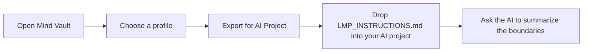

# AI project onboarding without a terminal

This is the zero-code path for founders, product managers, analysts, and
creators who work in a hosted AI project. You do not need Rust, a shell, or a
local repository to try the guidance layer.

## The four-step flow



## Step 1: Choose a profile

Open [Mind Vault](/docs/reference/mind-vault) and search by the kind of work
you are doing. Read the focus, principles, guardrails, source links, and
verification label before exporting.

Do not select a profile because its name sounds official. The card tells you
whether it is a verified public package, a local bundle, or a community
proposal. A proposal is useful for exploration but is not a signed runtime
package.

## Step 2: Export the plain-English file

Select **Export for AI Project** on the profile card. Your browser downloads a
single file named after the profile, ending in `-INSTRUCTIONS.md`.

The file contains:

- the profile identity, version, focus, availability, and verification state;
- plain-English engineering principles;
- readable versions of the profile guardrails;
- source links for the interpretation;
- a short checklist for tests, review, destructive actions, and limitations.

The export is generated locally in the browser from the card's actual data. It
does not upload your project, expose secrets, invent an IPFS address, or claim
that a referenced maintainer endorses the profile.

## Step 3: Add it to your AI project

Use the matching visual destination:

| Tool | Where to add the file | What to do next |
| --- | --- | --- |
| Claude Projects | Project knowledge / files area | Upload `*-INSTRUCTIONS.md`, then ask Claude to summarize the active boundaries. |
| ChatGPT Custom GPT | Knowledge files | Add the file as knowledge, then test with a small change request. |
| ChatGPT Project | Project files | Upload the file to the project, then ask which rules apply before generating code. |
| Bolt.new or v0 | Project context or uploaded files | Add the file before the first generation and keep it attached to later iterations. |
| Cursor, Cline, or Claude Code | Project workspace | Save it as `LMP_INSTRUCTIONS.md`; connect MCP separately when you need recorded evaluation. |

The file is guidance. It does not make a hosted AI tool run the Rust evaluator.
For a signed result with selected scope and findings, use the [MCP
integration](/docs/guides/mcp-integration) or [CLI reference](/docs/reference/cli).

## Step 4: Verify the handoff

Paste this request into the AI project after uploading the file:

```text
Read LMP_INSTRUCTIONS.md. Summarize the profile focus, three boundaries you
will follow, and anything the file cannot prove. Do not change files yet.
```

Then make a small, reversible request. Check that the response names the
profile boundaries instead of claiming that the file guarantees correctness.
For a real repository change, still run the project's tests and use LMP's
native evaluator when you need a machine-readable decision.

## Plain-English rule example

An exported guardrail such as `CLICK_OPS_DRIFT` becomes **Click Ops Drift** in
the file. The profile's own guidance explains the intended boundary; the
export does not pretend that a short label is a complete Terraform analyzer or
security audit.

## When to move to the developer path

Use the visual export when you need context for a hosted AI project. Move to
the developer path when you need:

- changed-file scope and a signed Mind Package;
- MCP tools that return structured evidence;
- repeatable CI checks;
- enforcement that can block a workflow.

Start with `npx lmp init` in the [CLI reference](/docs/reference/cli) and keep
the exported file as a readable companion to the verified package.
