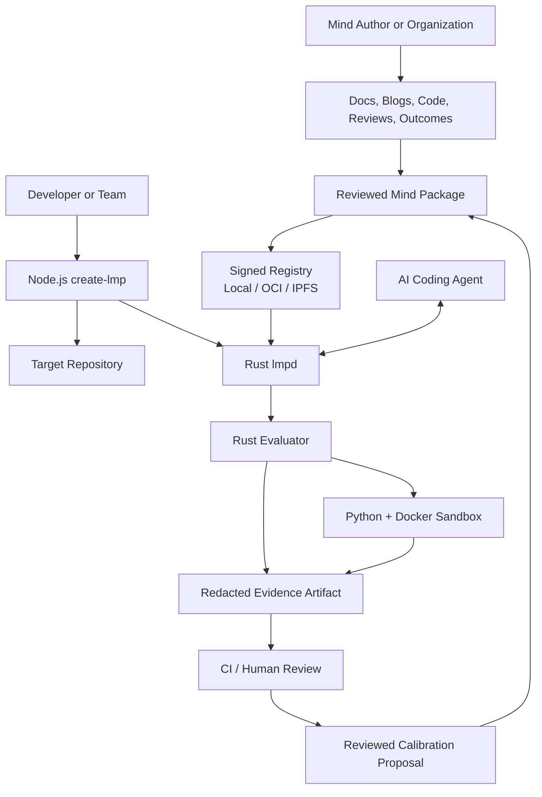
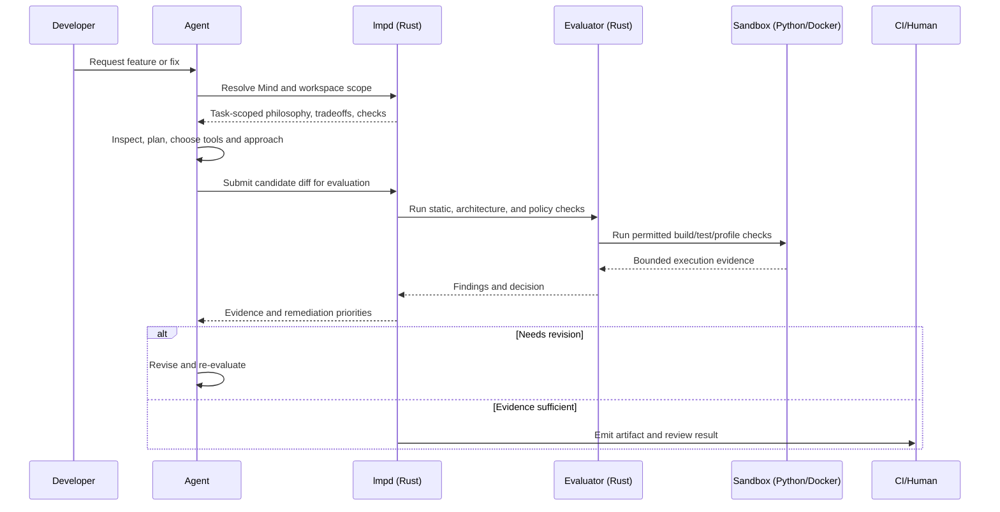
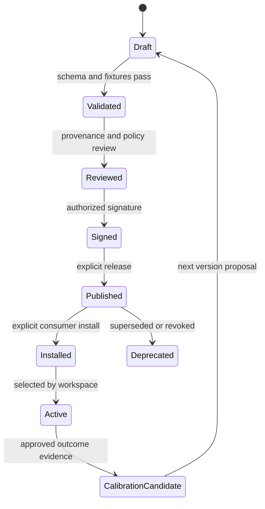
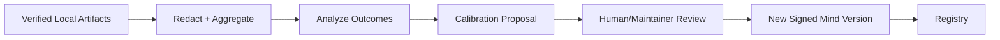

# LMP Architecture Diagrams

## System context



## Runtime flow



## Mind lifecycle



## Enterprise monorepo evaluation

```mermaid
flowchart LR
  root[Root Policy] --> resolve[Scope Resolver]
  diff[Changed Files] --> resolve
  graph[Package / Dependency Graph] --> resolve
  resolve --> affected[Affected Package Closure]
  affected --> fast[Fast Static Checks]
  affected --> matrix[Package Build/Test Matrix]
  root --> global[Global Security/API Invariants]
  fast --> artifact[Unified Artifact]
  matrix --> artifact
  global --> artifact
```

## Calibration boundary



Artifacts influence future Minds only through governed review and explicit version release. They never silently change workspace policy or third-party model weights.
